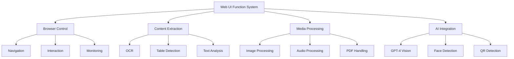
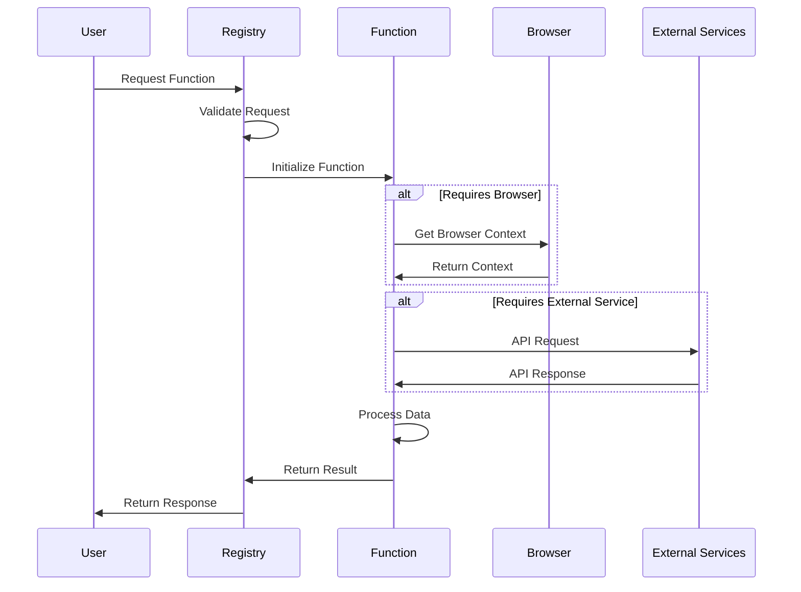
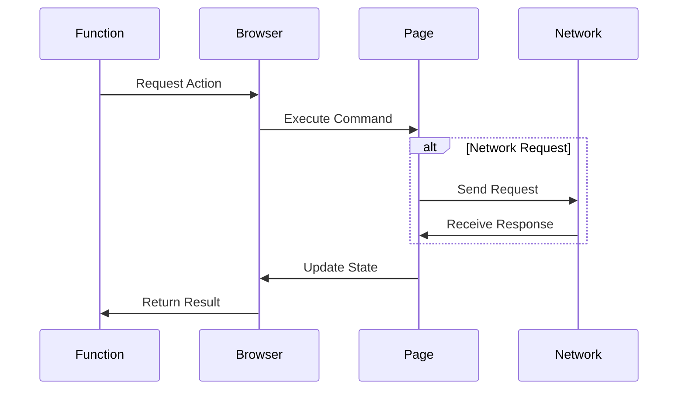
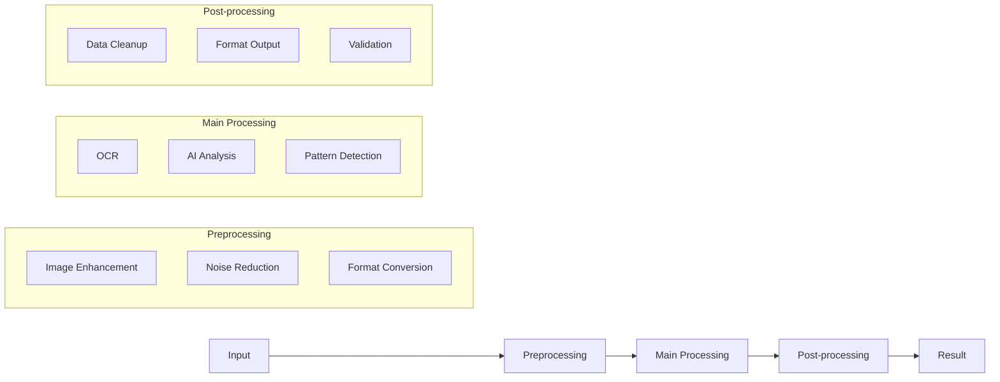
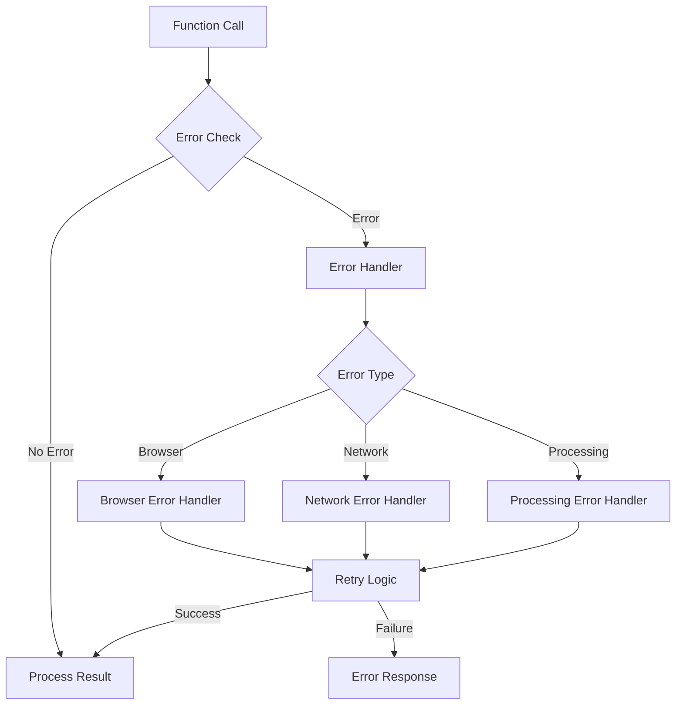
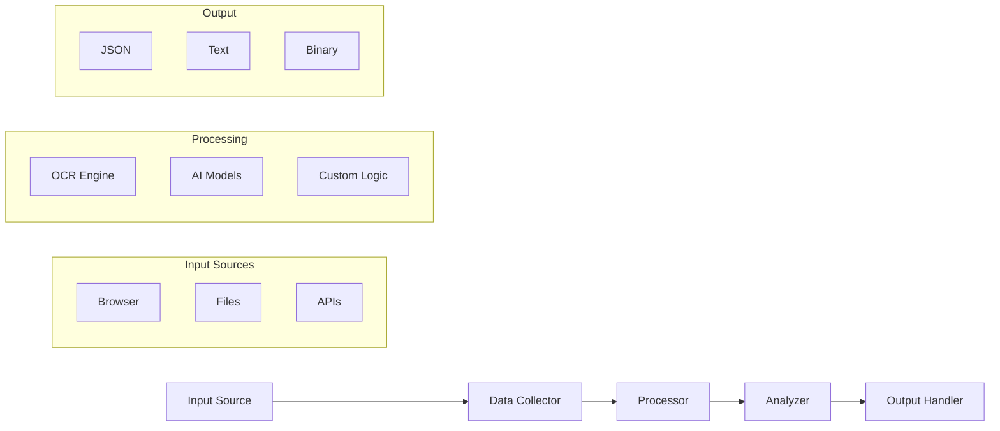
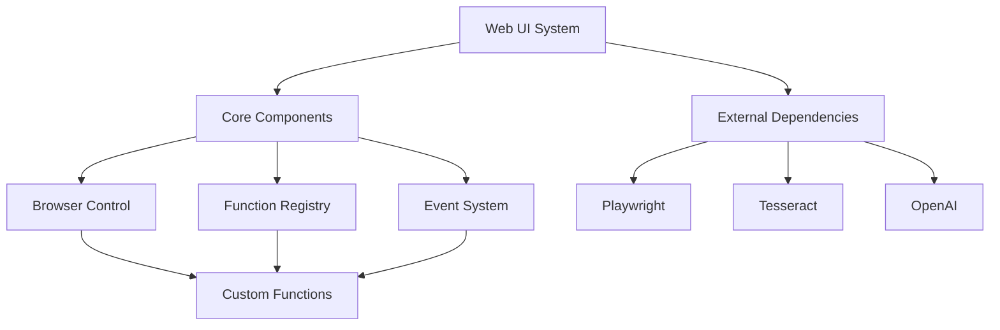
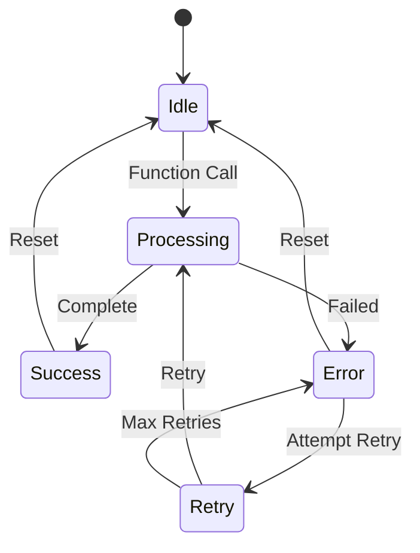
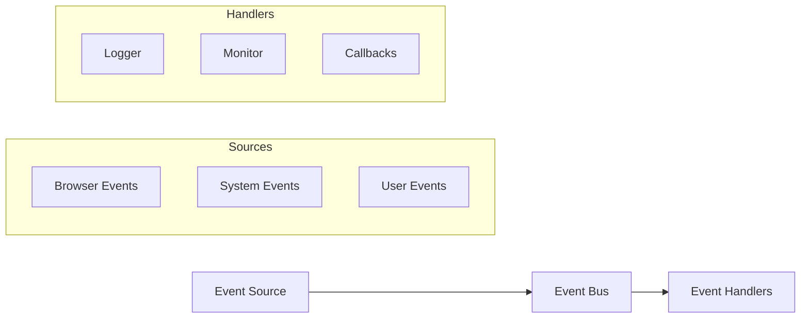
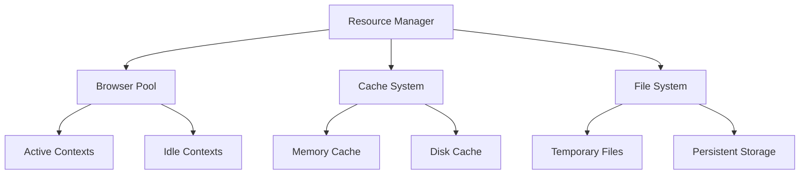

# System Flow and Architecture

## System Overview

## Function Execution Flow

## Browser Interaction Flow

## Content Processing Pipeline

## Error Handling Flow

## Data Flow Architecture

## Component Dependencies

## State Management

## Event System

## Resource Management

